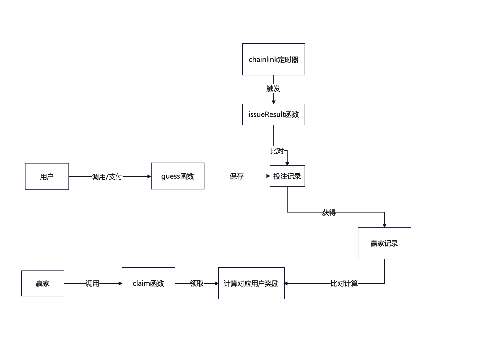

# Bet hardhat project

这个项目框架使用 hardhat

```shell
npx hardhat help
npx hardhat test
REPORT_GAS=true npx hardhat test
npx hardhat node
npx hardhat run scripts/bet.js
```

## 简介

用户竞猜下一个整点的 BTC 价格，每个人提交一定的 ETH 作为赌注，最接近实际价格的人获得奖池内所有 eth 奖励（平手则平分奖池）
该项目目前部署在 mubai 网络上，项目中所有账号均无存在任何价值仅供测试使用。

该项目在外部有一个 chainlink 定时触发获得当时 BTC 的价格，以此价格来和竞猜价格比对。

## 流程图


